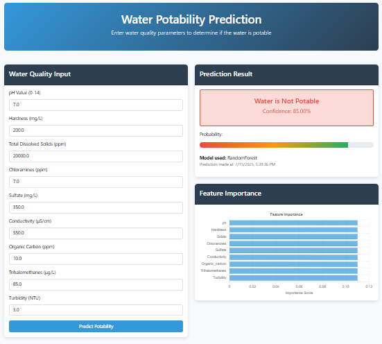

# 💧 Water Potability Prediction Web App

A beginner-friendly end-to-end **MLOps** project that predicts whether water is **potable** (safe to drink) using a trained ML model.

---

## 🌟 What's Inside?

- 📊 ML model built with **scikit-learn**
- ⚡ Backend using **FastAPI**
- 🖥️ Frontend with **HTML + CSS + JavaScript**
- 🐳 Dockerized for portability
- 🚀 Deployed on **Render**
- 🔁 CI/CD using **GitHub Actions**
- 📦 Optional **DVC** for versioning

---

## 🔥 Preview

> 🎯 Web UI for water quality prediction



---

## ✅ Features

- ✔️ Predicts potability from 9 water quality parameters
- ✔️ Clean and responsive web UI
- ✔️ FastAPI-based `/api/predict` endpoint
- ✔️ ML model served using `joblib`
- ✔️ Fully Docker-compatible
- ✔️ Live on Render (free-tier deployment)
- ✔️ CI/CD setup using GitHub Actions
- ✔️ Optional versioning with DVC

---

## 🧠 Tech Stack

| Layer       | Technology         |
|-------------|--------------------|
| Frontend    | HTML, CSS, JavaScript |
| Backend     | FastAPI            |
| ML Model    | scikit-learn       |
| Container   | Docker             |
| Deployment  | Render             |
| CI/CD       | GitHub Actions ⚙️  |
| Versioning  | DVC (optional)     |

---

## 🏗️ Architecture

```text
+--------------+      POST      +-------------+      Load      +---------------+
|  HTML / JS   +------------->  | FastAPI API +------------->  |  joblib Model |
+--------------+               +-------------+                +---------------+
       ^                             |                               
       |        Serves HTML/CSS/JS   |                               
       |                             v                               
+----------------+        +-------------------+                    
|  styles.css    |        |  app.js (logic)   |                    
+----------------+        +-------------------+
```

## 🚀 Live Demo

> [🌐 Visit App on Render]((https://water-potability-cicd-pipeline.onrender.com/))[water Potability]()


---

## 💻 Run Locally

Follow these steps to clone and run locally:

### 1. Clone the repository

```bash
git clone https://github.com/your-username/water-potability-mlops.git
cd water-potability-mlops
```
### 2. Install dependencies
```bash
pip install -r requirements.txt
```
### 3. Run the app with Uvicorn
``` bash
uvicorn web.main:app --reload --host 0.0.0.0 --port 8000
```
### Open browser at:
👉 http://localhost:8000

### 🐳 Run with Docker
```bash
docker build -t water-api .
docker run -p 8000:8000 water-api
```
---

## 📁 Project Structure
water-potability-app/
├── web/                        # Web-related files
│   ├── main.py                 # FastAPI app with API routes
│   ├── templates/
│   │   └── index.html          # Frontend HTML page
│   └── static/                 # Static frontend files
│       ├── css/                # Stylesheets
│       ├── js/                 # JavaScript logic
│       └── preview/            # UI screenshot(s) (optional)
│
├── models/
│   └── model.pkl               # Trained ML model (joblib or pickle)
│
├── src/                        # ML pipeline components
│   ├── data_collection.py      # Script to collect or load data
│   ├── data_prep.py            # Script to clean/preprocess data
│   ├── datamodel.py            # Pydantic BaseModel for request validation
│   ├── model_building.py       # Training script
│   ├── model_eval.py           # Model evaluation script
│   └── model_reg.py            # Optional: MLflow model registration
│
├── dvc.yaml                    # DVC pipeline configuration
├── params.yaml                 # Parameters used across pipeline
├── requirements.txt            # Python dependencies
├── Dockerfile                  # Docker setup for deployment
└── README.md                   # Project documentation


---

## 🙌 Acknowledgements

This project was built purely for **learning MLOps and CI/CD fundamentals**.

Special thanks to:
- The open-source community
- [FastAPI](https://fastapi.tiangolo.com/)
- [Scikit-learn](https://scikit-learn.org/)
- [Render](https://render.com/)
- [Docker](https://www.docker.com/)
- [DVC](https://dvc.org/)
- [MLflow](https://mlflow.org/) *(if used)

---

## 📬 Contact

Made with ❤️ by **[Irfan Shaikh](https://www.linkedin.com/in/irfan-shaikh911/)**

Feel free to connect or suggest improvements.  
🔗 GitHub: [IrfanShaikh911(https://github.com/irfanshaikh911)

---


